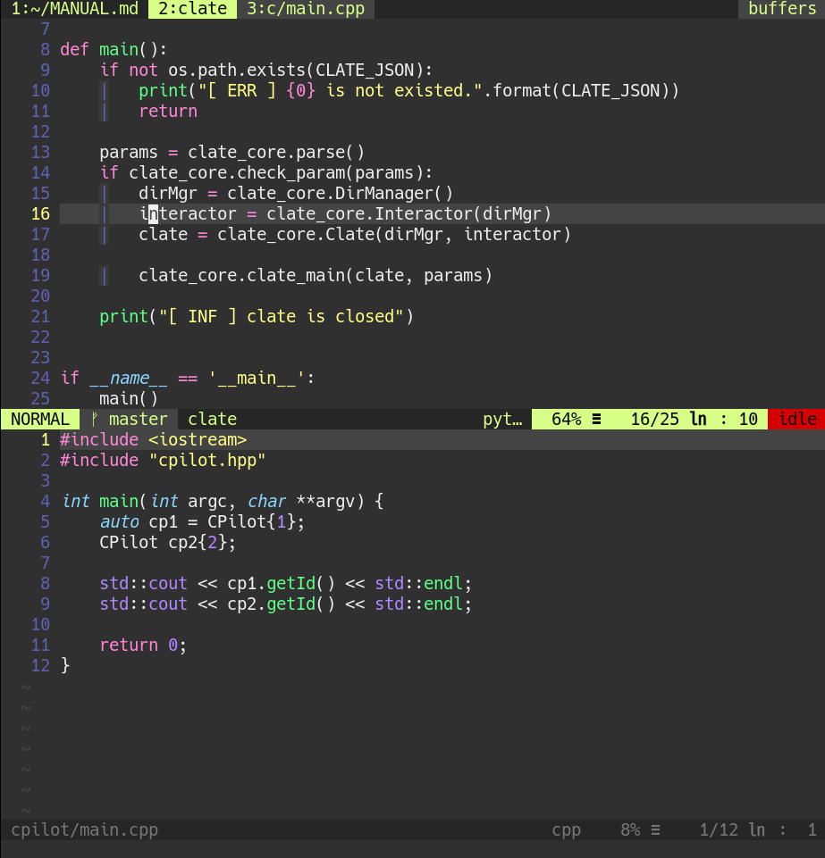

# Clate
VIM for C/C++ & Python on Docker



# Installation
0. Install Python Docker SDK
```
$ pip install docker
```
1. You can find your information with **id** linux command.
```
$ id [YOUR_ID]
```
  - If you use root account
```
$ id root
 uid=0(root) gid=0(root) groups=0(root),0(root),1(bin),2(daemon),3(sys),4(adm),6(disk),10(wheel),11(floppy),20(dialout),26(tape),27(video)
```
2. Fill config.json
  - COMMON_PATH is directory to keep sharing files among **Clate** instances.
  - Set "true" for target language.
  - If you failed to configure ssh environment, please find you ip address and fill HOST_IP out.
3. Execute install.py

# Console
* **Clate** console helps to manage projects.
  - create, show, remove project.
```
[ INF ] clate - 0.2
     [C]reate new project
     [L]ist projects
     [A]ctivate project
 dele[T]e proect
chang[E] version

     [G]enerate compile_commands.json

    e[D]it project configs
   st[O]p running project
   li[S]t running project

    e[X]it
[ ASK ] command:
```
* Creates new project
```
Command: c
Project name: [PROJECT_NAME]
Project directory: [PROJECT_PATH]
Do you have additional directory? (y/N)
Created: {'name': '[PROJECT_NAME]', 'version': 'VERSION', directory': {'Temp': u'[COMMON_PATH]/[PROJECT_NAME]/', 'Workspace': '[PROJECT_PATH]'}, 'build': {'build_cmd': '', 'run_cmd': ''}}
```
* Lists up all projects
```
$ clate -l
 0: clate
 1: cpilot
```
* Run project directly.
```
$ clate -a [PROJECT_NAME]
```

# Plugin
* [neoclide/coc.nvim](https://github.com/neoclide/coc.nvim)
* [kana/vim-operator-user](https://github.com/kana/vim-operator-user)
* [skywind3000/asyncrun.vim](https://github.com/skywind3000/asyncrun.vim)
* [Shougo/denite.nvim](https://github.com/Shougo/denite.nvim)
* [jsfaint/gen_tags.vim](https://github.com/jsfaint/gen_tags.vim)
* [tpope/vim-fugitive](https://github.com/tpope/vim-fugitive)
* [mhinz/vim-signify](https://github.com/mhinz/vim-signify)
* [chrisbra/vim-diff-enhanced](https://github.com/chrisbra/vim-diff-enhanced)
* [Shougo/neoyank.vim](https://github.com/Shougo/neoyank.vim)
* [justinhoward/fzf-neoyank](https://github.com/justinhoward/fzf-neoyank)
* [schickling/vim-bufonly](https://github.com/schickling/vim-bufonly)
* [jiangmiao/auto-pairs](https://github.com/jiangmiao/auto-pairs)
* [scrooloose/nerdcommenter](https://github.com/scrooloose/nerdcommenter)
* [bfrg/vim-cpp-modern](https://github.com/bfrg/vim-cpp-modern)
* [vim-python/python-syntax](https://github.com/vim-python/python-syntax)
* [t9md/vim-quickhl](https://github.com/t9md/vim-quickhl)
* [chrisbra/csv.vim](https://github.com/chrisbra/csv.vim)
* [ntpeters/vim-better-whitespace](https://github.com/ntpeters/vim-better-whitespace)
* [gabrielelana/vim-markdown](https://github.com/gabrielelana/vim-markdown)
* [scrooloose/nerdtree](https://github.com/scrooloose/nerdtree)
* [Xuyuanp/nerdtree-git-plugin](https://github.com/Xuyuanp/nerdtree-git-plugin)
* [jeetsukumaran/vim-buffergator](https://github.com/jeetsukumaran/vim-buffergator)
* [majutsushi/tagbar](https://github.com/majutsushi/tagbar)
* [skywind3000/quickmenu.vim](https://github.com/skywind3000/quickmenu.vim)
* [dracula/vim](https://github.com/dracula/vim)
* [vim-airline/vim-airline](https://github.com/vim-airline/vim-airline)
* [vim-airline/vim-airline-themes](https://github.com/vim-airline/vim-airline-themes)
* [Yggdroot/indentLine](https://github.com/Yggdroot/indentLine)
* [junegunn/fzf](https://github.com/junegunn/fzf)
* [junegunn/fzf.vim](https://github.com/junegunn/fzf.vim)
* [jesseleite/vim-agriculture](https://github.com/jesseleite/vim-agriculture)
* [SirVer/ultisnips](https://github.com/SirVer/ultisnips)
* [honza/vim-snippets](https://github.com/honza/vim-snippets)

# Usage

## Function key
*  F1: This README.md
*  F5: Refresh
*  F6: NERDTree
*  F7: TagBar
*  F8: Buffergator

* F11: CN menu
* F12: Menu

## Command
* FZF     : List all files in fzf window

```:FZF```

* Ag      : Grep [PATTERN] in current project

```:Ag [PATTERN]```

```:Ag -Q [PATTERN] [DIRECTORY]```

* GGrep   : Git grep [PATTERN] in current project

```:GGrep [PATTERN]```

* Gblame  : Git blame

```:Gblame```


## Short-cut
* &lt;C-c> l     : Next buffer
* &lt;C-c> k     : Prev buffer
* &lt;C-c> j     : Close buffer

* &lt;C-c> p     : Next quickfix
* &lt;C-c> o     : Prev quickfix
* &lt;C-c> i     : Close quickfix

## Cscope
* &lt;C-\\> c    : Find functions calling this function
* &lt;C-\\> d    : Find functions called by this function
* &lt;C-\\> e    : Find this egrep pattern
* &lt;C-\\> f    : Find this file
* &lt;C-\\> g    : Find this definition
* &lt;C-\\> i    : Find files including this file
* &lt;C-\\> s    : Find this C symbol
* &lt;C-\\> t    : Find this text string

## Leader: ,

## Search file
* &lt;leader> ff : Fuzzy file search

## Multiple highlight
* &lt;leader> h  : Mark word highlight
* &lt;leader> hh : Clear word highlight

## Language Server Protocol
* &lt;leader> d  : Jump to definition
* &lt;leader> t  : Check type
* &lt;leader> i  : Jump to implementation
* &lt;leader> r  : List to reference
* &lt;leader> n  : Rename

## GNU Global
* &lt;leader> gd  : Jump to definition
* &lt;leader> gr  : Find reference
* &lt;leader> gs  : Search the word

## Miscellaneous
* &lt;leader> g  : Find definition for word on cursor

* &lt;leader> y  : List for yank

* &lt;leader> w  : Strip white space

* &lt;leader> c &lt;space> : Toggle comment
