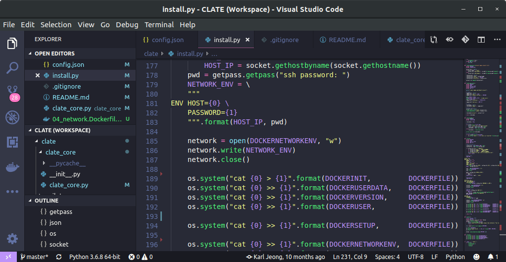

# Clate
VS Code server in Docker



# History
* v0.1
  - native vim + youcompleteme
* v0.2
  - neovim + coc.nvim + ccls
* v0.3
  - vs code server + ccls

# Installation
0. Install Python Docker SDK
```
$ pip3 install docker
```
1. You can find your information with **id** linux command.
```
$ id [YOUR_ID]
```
  - If you use root account
```
$ id root
 uid=0(root) gid=0(root) groups=0(root),0(root),1(bin),2(daemon),3(sys),4(adm),6(disk),10(wheel),11(floppy),20(dialout),26(tape),27(video)
```
2. Fill config.json
  - COMMON_PATH is directory to keep sharing files among **Clate** instances.
  - Set "true" for target language.
  - If you failed to configure ssh environment, please find you ip address and fill HOST_IP out.
3. Copy your id_rsa.pub to clate/docker/artifact/
4. Execute install.py

# Console
* **Clate** console helps to manage projects.
  - create, list, active, remove project.
```
[ INF ] clate - 0.3
     [C]reate new project
     [L]ist projects
     [A]ctivate project
 dele[T]e proect
     [E]dict project configs

     [G]enerate compile_commands.json

   st[O]p running project
   li[S]t running project

    e[X]it
[ ASK ] command:
```
